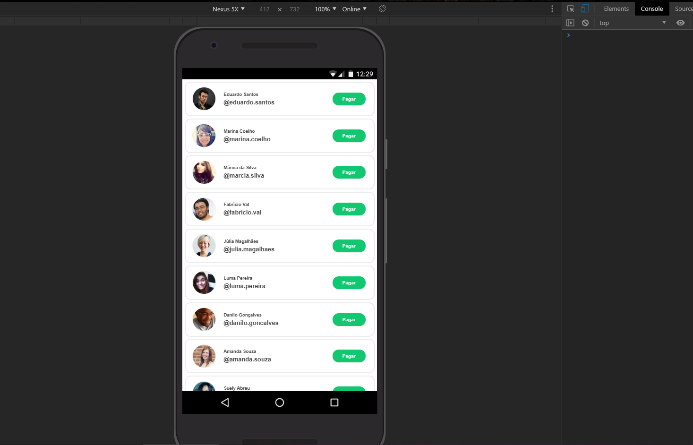
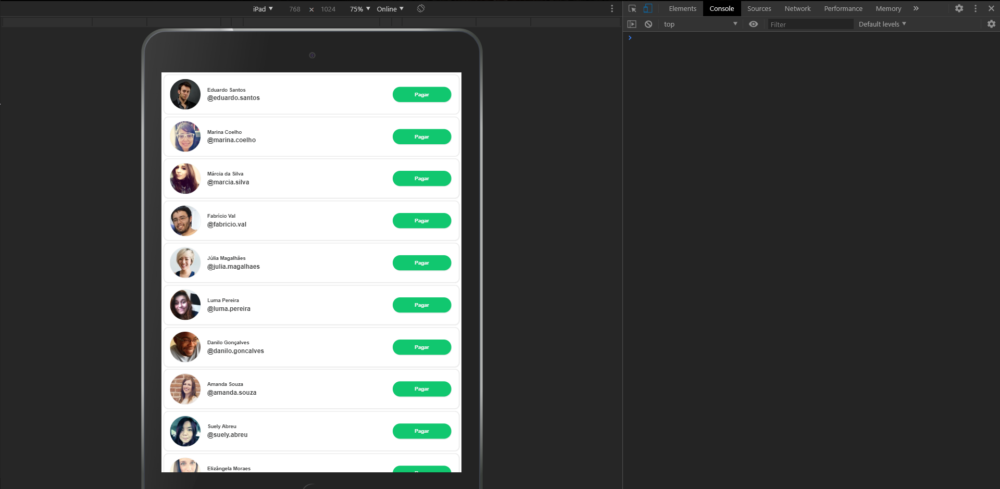
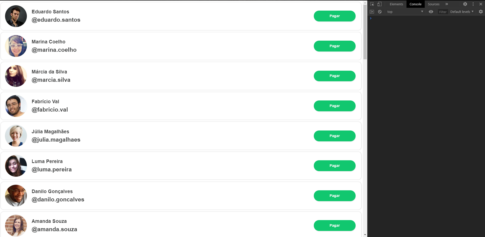

# Desafio Front-end PicPay

# Interface ⤵︎

## Video de Navegação
video: https://www.youtube.com/watch?v=Wmwn15cvEFw&feature=youtu.be

## Layout Mobile

## Layout Tablet

## Layout Web

## Testes ⤵︎
#### Fiz alguns testes simples de unidade, para executar -> ng test
#### Nas requisições para o backend deixei um console.log() para verificar o retorno, cunho de desenvolvimento, cada retorno traz um modal diferente de acordo com a resposta da transação,se foi feita com sucesso ou não, no video eu mostro com detalhes.

### obs: os endpoints disponibilizados no teste não estão funcionando desde sexta, logo quando eu comecei a fazer o desafio parou, mas criei duas apis para fazer o teste, o resultado é o mesmo, qualquer problema só trocar as rotas no environment.ts

##### (environment.ts)  ⤵︎
#### 'apiUsers': 'https://private-ba7f3-rprteste.apiary-mock.com/users' //retorna os usuarios
#### 'apiTransaction': 'https://5f0b66a99d1e150016b374d9.mockapi.io/api/payload' //post com o payload e dados do usuário
