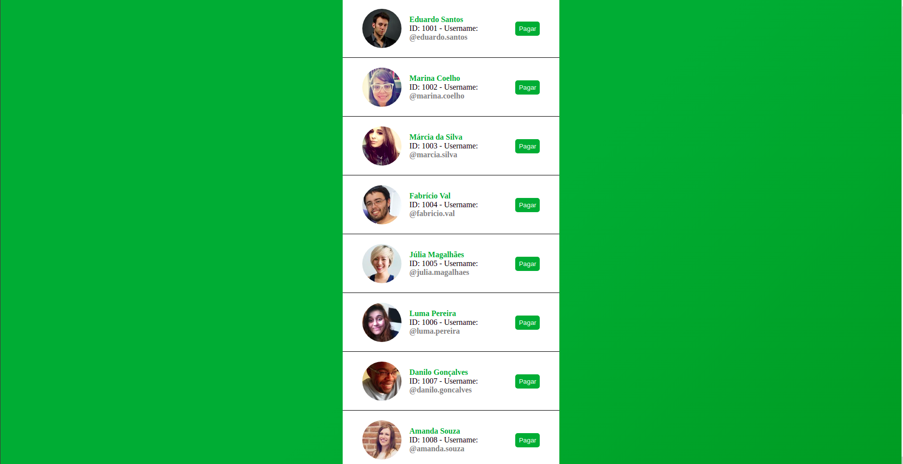
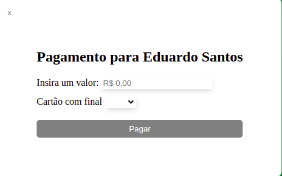
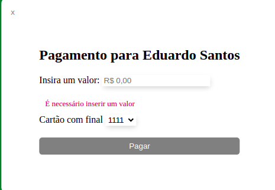
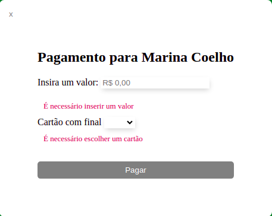
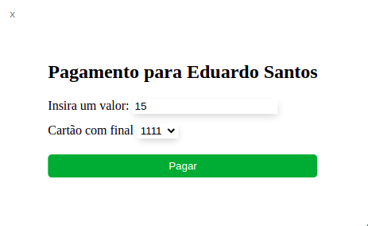
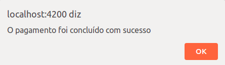

# Desafio Front-end PicPay

Desafio utilizando as seguintes tecnologias: RxJs para requisição HTTP, pacote LazyLoadImage para carregamento das imagens de maneira perfomática, a bilioteca NgxSpinner para exibição e gerenciamento de carregamento de tela.

## Setup do Projeto

- Angular CLI: 8.3.18
- Node: 10.15.3
- Angular: 8.2.14

## Bibliotecas instaladas

- NgxSpinner: 9.0.2
- Ng LazyLoad Image: 9.1

## Como rodar?

- Instale as dependências usando o comando `npm install` ou `npm i`
- Na raíz do repositório, rode este comando `ng serve` ou `ng s` para iniciar o servidor de desenvolvimento.
- A aplicação estará disponível na porta `http://localhost:4200/`
- Para executar a aplicação e abrir o navegador automaticamente, rode o comando `ng serve -o` ou `ng s -o`.

## Testes unitários

Foram feitos testes dos componentes `Users` e `Transaction` assim como seus respectivos serviços utilizando Jasmine e Karma, garantindo que as requisições estejam sendo realizadas corretamente.

Para executar os testes, rode o comando `ng test` ou `ng t`.

## Aplicação e screenshots

Ao iniciar a aplicação ou recarregar a página, aparece um layout de carregamento enquanto a requisição que busca os usuários da API não finaliza.

### Carregamento

Ao finalizar a requisição exibe uma lista de usuários, com informações de nome, foto, username e id, bem como um botão de pagar para cada um deles.

### Lista de usuários

Por existir muitos usuários e fotos de cada usuário, foi feito um sistema de cacheamento para que torne a aplicação mais perfomática, evitando que faça múltiplas requisições desnecessárias. As imagens também utilizam Lazy Loading com o mesmo propósito.

O estilo da página foi modificado para as cores do PicPay e foi criado variáveis de todas as cores que estão sendo utilizadas na aplicação para fácil e rápida manuntenção.

### Modal de pagamento

Ao clicar em "Pagar", é exibido um modal com o nome do usuário. No conteúdo do modal, temos um input que aceita apenas número, representando o valor a ser transferido e embaixo, é um select com duas opções a serem escolhidas, que são os dois cartões disponíveis. No primeiro momento, o botão de "Pagar" dentro do Modal está inativo para não permitir que o usuário faça uma transferência sem registrar um valor de transferência e cartão.

Ao clicar no input de valor e não digitar um número, é exibido uma mensagem de erro solicitando que o usuário digite um número. O botão de "Pagar" continua travado.

O mesmo comportamento ocorre com o select, caso o usuário abra as opções e não selecione nenhum.

As validações de campo foram feitas utilizando a biblioteca do Angular Forms.

Com os dados validados, as mensagens de erro desaparecem e o usuário pode concluir sua transferência.

### Mensagem de feedback

Ao clicar em "Pagar", será exibido um alerta com mensagem dependendo da escolha do cartão, podendo ser um alerta de sucesso ou de erro:

Após fechar o alerta, o modal é fechado automaticamente.

Após exibir a mensagem de erro, o modal não é fechado para que o usuário possa escolher o cartão válido com mais rapidez.

# Sugestão de melhoria
Acredito que para definir que um cartão seja válido ou inválido com os cartões a serem trabalhados, possamos trabalhar da seguinte maneira:

Caso o `expiry_date` seja inferior ao ano atual, ao clicar em "Pagar", a transação não é concluída e dispara uma mensagem de erro pro usuário.

Dessa forma trará mais sentido para termos um cartão válido e outro inválido.

