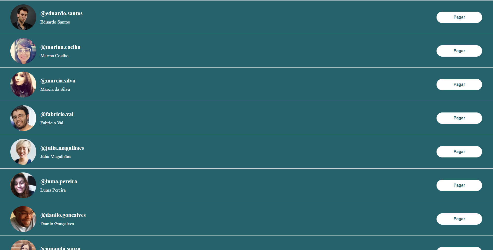
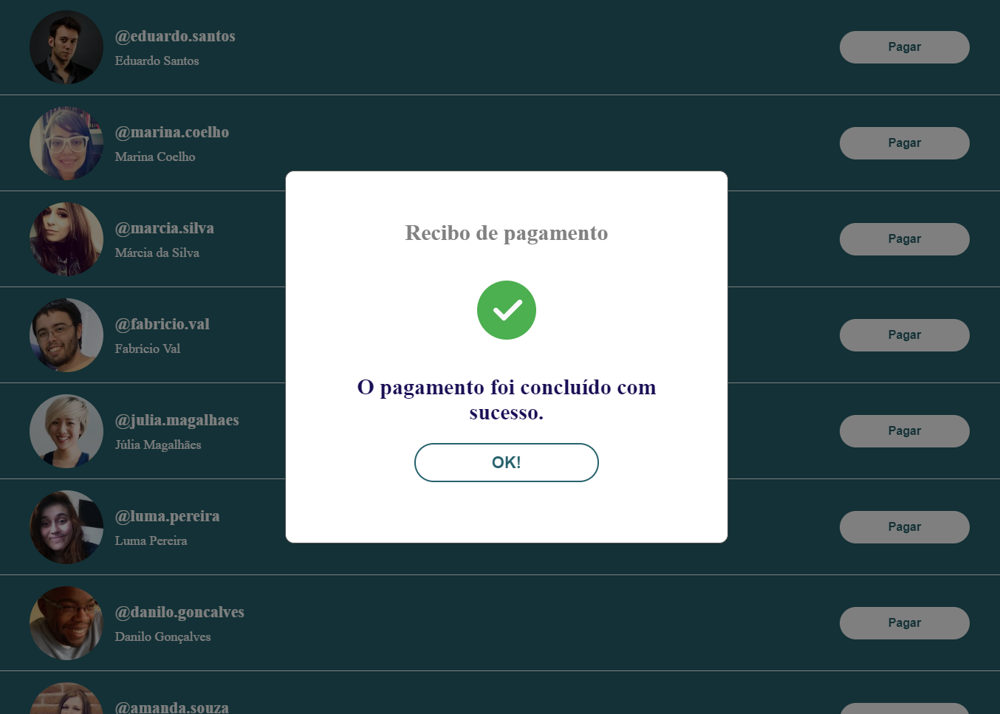
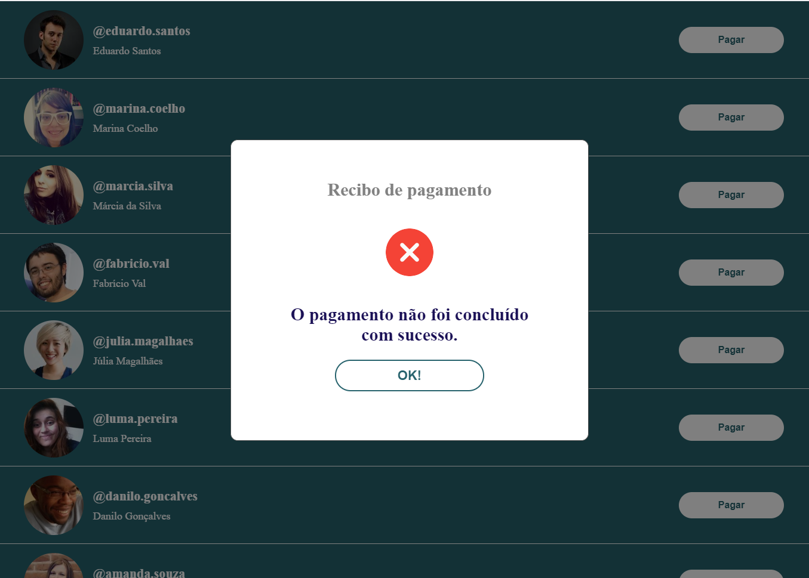

# Desafio Front-end PicPay

## Instruções

Instale as **dependências**

```bash npm install```

Rode o comando:

```bash ng serve```

A Aplicação estará disponível na porta:

 ```bash http://localhost:4200/```

## Screenshots

### Layout Mobile


### Layout Desktop



### Modal de pagamento


### Modal de pagamento concluído com sucesso



### Modal de pagamento não concluído com sucesso



obs: os endpoints disponibilizados para o teste ficaram offline durante o final de semana, utilizei outras API's mockadas para o desenvolvimento.