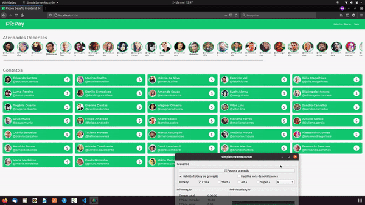
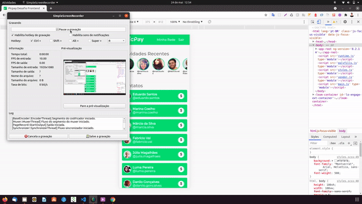

# Desafio Front End - Mateus Queiroz

Nesse desafio tive como objetivo desenvolver uma App intuitiva, acessível e principalmente agradável ao usuário.
E para isso, os conceitos abaixo foram satisfeitos:
- Mobile First 
- Responsividade

## Features
- Listagem de todos os contatos
- Realização de pagamentos a contatos do usuário

## Overview





## Rodando a aplicação
- Instale as dependências usando o comando ```npm install```
- Na raiz do repositório, rode este comando ```npm run start``` para iniciar o servidor de desenvolvimento.
- A Aplicação estará disponível na porta http://localhost:4200/

## Rodando testes unitários
- Na raiz do repositório, rode este comando ```npm run test ``` para rodar os testes unitários

## Rodando testes end-to-end
- Na raiz do repositório, rode este comando ```npm run e2e ``` para rodar os testes e2e
