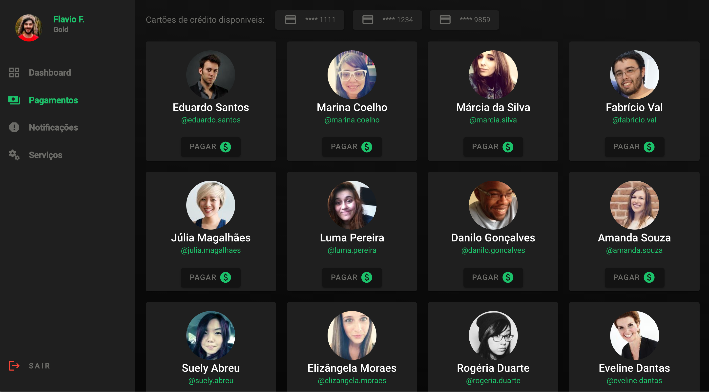
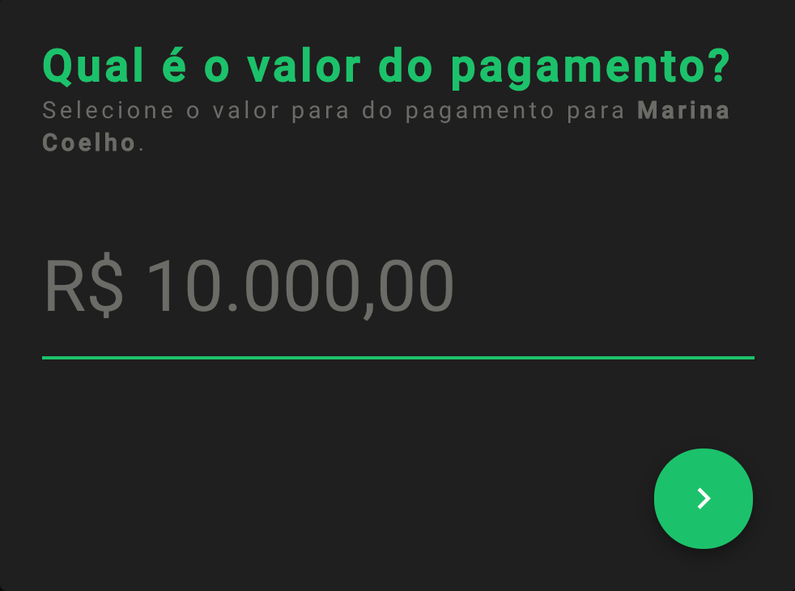
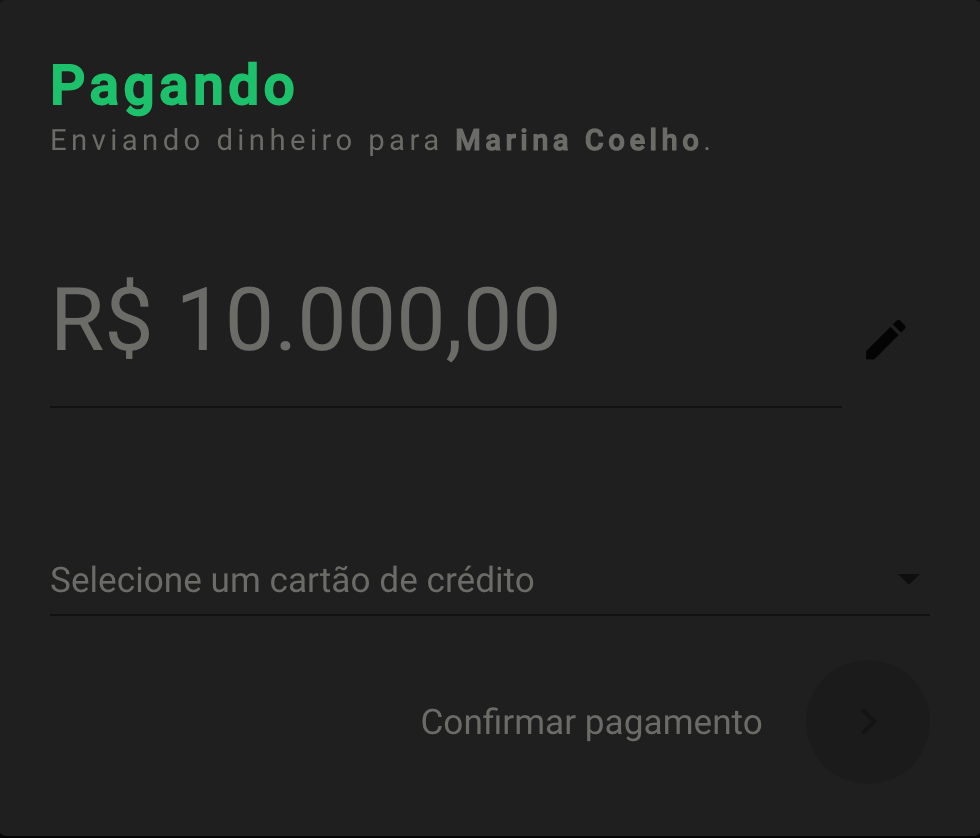
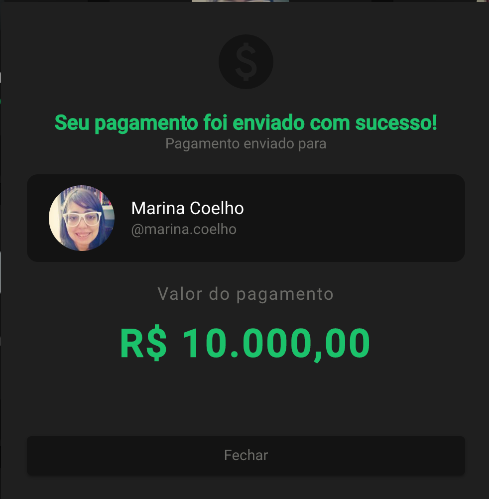
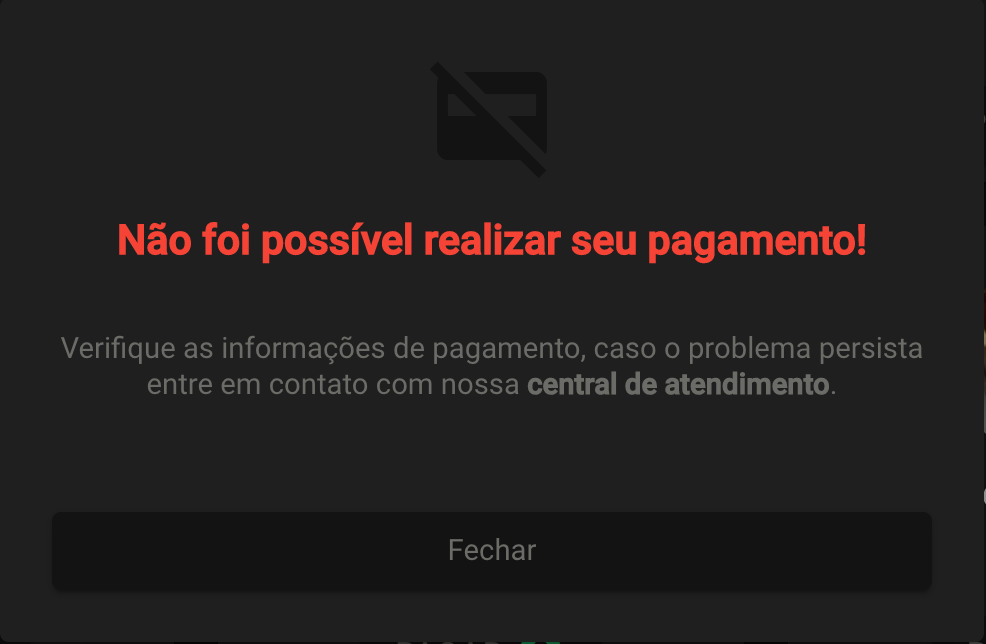

# Desafio Front-end PicPay

Teste desenvolvido por Flávio Maran Florentino. 
Gostaria de agradeçer a oportunidade de participar do processo seletivo :)

## Setup do projeto

- Angular CLI: 8.3.18
- Node: 10.15.3
- Angular: 8.2.14

## Como Rodar?

- Instale as dependências usando o comando `npm install`
- Na raiz do repositório, rode este comando `npm start` para iniciar o servidor de desenvolvimento.
- A Aplicação estará disponível na porta `http://localhost:4200/`

## Rodando testes

### Testes unitários
Comando ira acionar o `jest`.

- `npm run test`

### Teste e2e
Comando ira acionar o `cypress`.

- `npm run cypress:run` ou `npm run cypress:open`

## Como submeter?

- Commite suas alterações de forma organizada;
- Após o prazo dado para a realização do teste, será dada permissão para fazer o push/ abrir a pull request, abra uma pull request da sua branch para a master com a nomenclatura: Nome Sobrenome - dd-mm-yy

_Obs: Caso não tenha recebido permissão para realizar o push da branch entre em contato com o recrutador e envie seu usuário do GitHub_

## Objetivo

O objetivo é construir uma aplicação que simula o envio de dinheiro para uma outra pessoa, via cartão de crédito.

## Fluxo das telas

Na primeira tela terá uma listagem de usuários, onde a pessoa pode clicar em algum usuário da lista para realizar o pagamento. Quando clicado em um usuário é então aberto um modal de pagamento, contendo as informações do usuário de destino, a opção de selecionar um cartão de crédito e um botão de pagar. O usuário deve então digitar o valor, escolher o cartão e clicar em pagar. Para realização do pagamento deve-se chamar um endpoint de pagamento que aprovará/recusará a transação. E então deve-se mostrar na tela o modal de pagamento concluído com sucesso ou o de erro.

## Screenshots 

### Lista de usuários

### Modal de pagamento / Seleção do valor

### Seleçao do cartão / Confirmação do valor

### Modal de pagamento concluído com sucesso

### Modal de erro no pagamento

